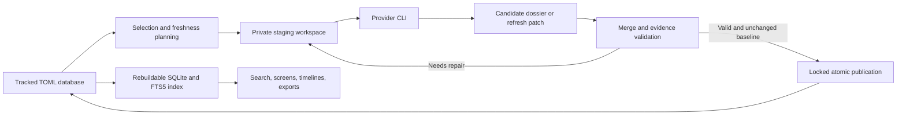

<p align="center">
  <a href="https://tensorspace.ai">
    
  </a>
</p>

# Startup DB

[](https://github.com/tensorspace-ai/startup-db/actions/workflows/ci.yml)
[](LICENSE)
[](pyproject.toml)
[](data/startups)

**A startup database you can read, and a research agent whose work you can inspect.**

Startup DB brings public company evidence, structured private-market research,
and resumable AI workflows into one Git repository. Explore products, teams,
funding rounds, investors, ownership, financial metrics, and traction while
retaining source links, dates, conflicts, and research gaps.

Built by [TensorSpace](https://tensorspace.ai), extracted from the Claw & Talon
startup database and research agent, and released under Apache 2.0. The inherited
research contract focuses on Israeli and Israeli-founded technology companies,
including companies headquartered overseas.

[Get started](#quick-start) · [Explore the data](#explore-the-database) ·
[Run research](#discover-enrich-and-refresh) · [Architecture](#how-it-works) ·
[Agent guide](docs/agent.md) · [Privacy](docs/privacy.md)

## What is inside

| Layer | What it gives you |
| --- | --- |
| **Database** | Human-readable TOML profiles with original analysis and, where available, evidence-linked v2 dossiers. Git diffs make changes reviewable. |
| **Research agent** | One `startup-agent` CLI for discovery, enrichment, and topic-specific refresh through Codex, Claude Code, or GitHub Copilot CLI. |
| **Publication checks** | Typed schema validation, source references, claim checks, identity matching, research-depth requirements, and preservation of existing authored content. |
| **Research tools** | A rebuildable SQLite/FTS5 index, company search, funding and investor screens, saved screens, JSON/CSV exports, and coverage audits. |

The source of truth is the TOML database. You can browse the files directly,
review them in Git, or use the CLI without starting an AI research provider.

## Dataset coverage

The initial snapshot contains **1,894 TOML records**:

| Coverage | Records |
| --- | ---: |
| Searchable company and organization profiles | 1,870 |
| Structured schema-v2 dossiers | 477 |
| Legacy profiles awaiting structured enrichment | 1,393 |
| Redirect records | 24 |

All 477 structured dossiers pass the current publication contract with its
default source and analysis requirements. Passing that contract establishes
structural consistency; it does not independently verify every source or claim.
Legacy profiles remain useful for search and selection, but their prose does not
supply verified financial values to structured screens. The corpus also includes
funds, acquired companies, public companies, and other organizations; not every
profile represents an active, independent startup.

The snapshot retains source timestamps and dated research checks. It is not a
live market feed, a complete global investor portfolio database, or access to
licensed commercial data. Inspect original sources before relying on a claim.
Use `audit` to assess current coverage after editing or enriching the catalog.

## Quick start

You need **Python 3.11+** and [uv](https://docs.astral.sh/uv/). An authenticated
provider CLI is required only for agent research.

```sh
git clone https://github.com/tensorspace-ai/startup-db.git
cd startup-db
uv sync --locked
git config --local core.hooksPath .githooks

# Inspect available commands and build the local search index.
uv run startup-agent --help
uv run startup-agent index

# Explore without starting a research provider.
uv run startup-agent screen quantum --limit 10
uv run startup-agent company quantum-machines

# Inspect a proposed discovery prompt without invoking a provider.
uv run startup-agent discover --config agent.example.toml --dry-run
```

The index lives in ignored `.agent-runs/research.sqlite3`. Indexed commands
refresh changed files automatically; deleting the index does not delete the
underlying TOML dossiers. Dry runs print proposed prompts and commands without
creating research-run state or invoking a provider.

## Explore the database

### Companies, deals, and investors

```sh
# Name and narrative search, including legacy profiles.
uv run startup-agent screen robotics --entity-type startup --limit 20

# Structured, sourced Israeli identity and reported funding filters.
uv run startup-agent screen --israel confirmed --min-schema 2 --min-funding 100000000

# Use observed equity rounds rather than a reported company-wide total.
uv run startup-agent screen --funding-basis observed_equity --currency USD --min-funding 10000000

# Funding events and an investor's participation within this catalog.
uv run startup-agent deals --since 2025 --kind funding --min-amount 50000000
uv run startup-agent investors "Red Dot"
uv run startup-agent investors "Red Dot Capital Partners" --portfolio
```

Funding filters use structured values, preserve currencies, and exclude missing
amounts. Observed equity totals exclude debt, grants, secondary proceeds,
cancelled or targeted transactions, and amounts whose cumulative scope is
unresolved. No currency conversion is implied. Investor portfolios describe
participation in catalog companies, rather than an investor's complete portfolio.

### Saved screens, exports, and audits

```sh
# Save a query and inspect changes to its matching records later.
uv run startup-agent screen quantum --save quantum-companies
uv run startup-agent watch quantum-companies

# Keep generated exports outside the tracked database.
mkdir -p exports
uv run startup-agent export --output exports/dossiers.json
uv run startup-agent export --format funding-csv --output exports/funding-rounds.csv
uv run startup-agent audit > exports/coverage-audit.json

# Inspect the full dossier and incremental-refresh contracts.
uv run startup-agent schema > exports/dossier-schema.json
uv run startup-agent schema --refresh > exports/refresh-schema.json
```

Saved screens checkpoint added, removed, and changed matches locally. They do not
send notifications. Exports and audit reports can contain research content; the
`exports/` directory is ignored by Git.

## Discover, enrich, and refresh

Install and authenticate your chosen CLI separately. Research uses its configured
account and can incur provider charges. `doctor` checks availability without
starting research:

```sh
uv run startup-agent doctor

# Discover one distinct startup that passes publication validation.
uv run startup-agent discover --provider codex --limit 1

# Enrich a selected profile, preserving existing authored content.
uv run startup-agent improve --only vendict --provider claude

# Refresh only due funding and investor topics for one company.
uv run startup-agent refresh --only quantum-machines --topics funding,investors

# Plan a bounded batch before launching it.
uv run startup-agent plan --topics funding,investors --stale-days 30 --limit 20
uv run startup-agent refresh --topics funding,investors --limit 20
```

| Workflow | Behavior |
| --- | --- |
| `discover` | Research a new identity and publish only a distinct, validated dossier. The default limit is one successful publication. |
| `improve` / `enrich` | Expand existing profiles. Legacy records receive the structured baseline required for targeted refresh. |
| `refresh` | Update selected topics. By default, skip fresh topics and defer unchanged records that recently exhausted validation attempts. |
| `plan` | Inspect missing, stale, or conflicting topics before deciding what to research. |

Discovery is sequential so later prompts see newly published identities.
Enrichment can use `--jobs N` for separate staging workspaces. Codex uses its
configured model unless `--model` is supplied. `--force` bypasses freshness and
failure deferral; `--retry-failed-days 0` permits immediate retries of otherwise
unchanged validation failures. Use these deliberately when new research is needed.

### Resume work instead of repeating it

```sh
uv run startup-agent status
uv run startup-agent metrics

# Replace RUN_ID with an ID reported by status.
uv run startup-agent discover --resume RUN_ID
uv run startup-agent refresh --resume RUN_ID
```

Runs checkpoint selections, provider settings, attempts, validation feedback, and
publication state. Resume restores the stored workflow and skips completed jobs.
Rejected drafts and validation errors stay available for repair. Durably successful
provider output can be recovered without another provider call; interrupted,
failed, or rejected calls are not treated as completed research.

## Configuration

Start with [agent.example.toml](agent.example.toml). Copy it to ignored `agent.toml`
for private customization, then pass `--config agent.toml` after the subcommand.
Explicit CLI options override the configuration file.

```toml
[agent]
provider = "codex"
directory = "data/startups"
state_dir = ".agent-runs"
focus = "Israeli or Israeli-founded technology startups with public evidence"
min_sources = 4
min_words = 900
limit = 1
timeout = 900
max_attempts = 3
max_rate_limit_retries = 3
jobs = 1
```

Paths resolve against `root`, which defaults to the working directory. Keep
`state_dir` outside the startup directory. Provider credentials belong in the
provider's normal authentication setup, not in either configuration file.

Discovery defaults to 900 analysis words and four distinct sources, with at least
one non-company source. Enrichment defaults to 700 words. These are publication
requirements, not guarantees that a research result is correct. See the
[agent guide](docs/agent.md) for selection, retry, timeout, model, and sandbox options.

## How it works



Providers receive a compact catalog, schema guidance, and relevant existing
context. They write candidates or partial updates outside the live database.
A staged checker applies the same merge and validation contract used by the host.
The host rechecks identity and the original-file checksum, then publishes under a
lock using atomic replacement. Concurrent edits are protected from overwrite.

Typed intelligence adds company identity, Israeli connection, funding, people,
investors, ownership, financials, traction, intellectual property, comparables,
and research metadata to legacy top-level profile fields. Research metadata
retains source IDs, URLs, publishers, timestamps, search queries, dated topic
checks, claim checks, gaps, and conflicts. Critical numerical claims require
direct, source-linked checks. Unknown financials and private cap tables remain
unknown; conflicting funding observations do not silently become canonical totals.

## Repository layout

```text
startup-db/
├── assets/readme-hero.svg      TensorSpace-style vector artwork
├── data/startups/             Tracked TOML profiles and dossiers
├── src/startup_db/            Python package and startup-agent CLI
├── tests/agent/               Offline regression tests with mocked providers
├── scripts/                   Compatibility launchers and privacy checks
├── docs/agent.md              Detailed workflow and command reference
├── docs/privacy.md            Publication and provider-data guidance
├── agent.example.toml         Public, credential-free configuration example
├── pyproject.toml / uv.lock   Package metadata and locked dependencies
├── .githooks/                 Staged-file checks
└── .agent-runs/               Ignored local state, prompts, and provider logs
```

## Privacy and responsible publication

The contributed database is public. Put private notes outside `data/startups`.
Provider research can send selected dossier context and catalog identities to the
selected service and use that CLI's configured tools. Staging is not an
operating-system isolation guarantee. Read [privacy guidance](docs/privacy.md)
before giving a provider nonpublic material.

Saved runs, transcripts, rejected drafts, credentials, private configuration,
exports, caches, and local databases are excluded from Git. The pre-commit hook
and CI inspect indexed blobs for sensitive paths, common credentials, private
keys, binary files, symlinks, and local home paths without printing matched values.
Those checks are heuristics: review the exact staged diff and run an independent
secret scanner before publishing. GitHub secret scanning and push protection are
also enabled on this repository.

## Development and contributions

```sh
uv sync --locked
uv run pytest
uv run ruff check src scripts tests
uv run ruff format --check src scripts tests
uv run mypy
uv build --out-dir python-dist

# Stage only reviewed changes, then inspect the publication checks.
git add README.md
python3 scripts/check_public_tree.py
git diff --cached --check
git diff --cached
```

CI runs the privacy check, linting, formatting, type checks, tests, package build,
and a discovery dry run on Python 3.11 and 3.12. Provider behavior is tested with
mocks; passing offline tests does not establish autonomous research accuracy.

For data corrections, link original sources, retain dates and disclosure limits,
and distinguish reported facts from inference. Preserve stable IDs and existing
historical evidence. Validate structured records with:

```sh
uv run startup-agent validate data/startups/quantum-machines.toml
```

Use `validate --legacy` for limited checks on older profiles. Report issues through
[GitHub issues](https://github.com/tensorspace-ai/startup-db/issues) and submit
focused pull requests with the relevant validation result. Keep private notes
and provider transcripts out of contributions.

## License and provenance

Software, documentation, README artwork, and contributed database content are
licensed under the [Apache License 2.0](LICENSE), at the IP owner's direction.
See [NOTICE](NOTICE) for provenance. Company names and trademarks remain with
their respective owners; source links do not relicense third-party websites,
logos, or linked material.

The initial dataset and agent were extracted from a committed Claw & Talon
snapshot. Original deployment configuration, generated rankings, rejected
drafts, saved runs, transcripts, and uncommitted source changes were excluded.
The README's visual language adapts [TensorSpace](https://tensorspace.ai)'s dark
navy palette, blue accents, and single `T_` mark into a simple static banner
that renders in GitHub. Browse the full workflow reference in
[docs/agent.md](docs/agent.md).
